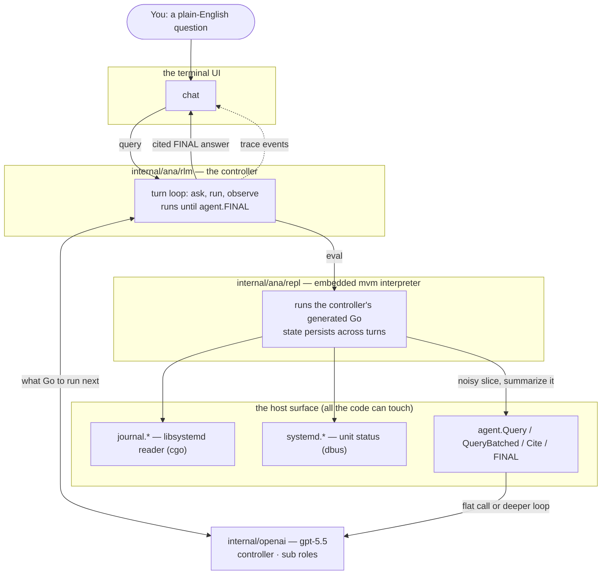
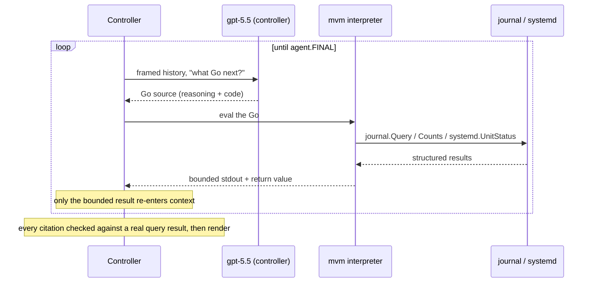
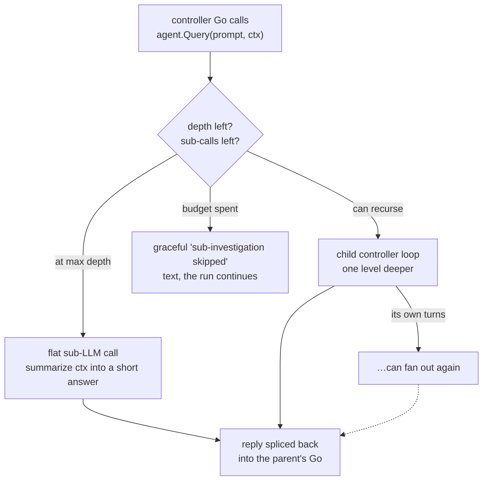

<p align="center">
  <a href="https://pkg.go.dev/github.com/omarluq/anamnesis"></a>
  <a href="https://go.dev/"></a>
  <a href="https://goreportcard.com/report/github.com/omarluq/anamnesis"></a>
  <a href="LICENSE"></a>
  <a href="https://github.com/omarluq/anamnesis/actions/workflows/ci.yml"></a>
</p>

anamnesis _(/ˌanəmˈnēsəs/, Greek for "remembrance", a calling-to-mind [^1])_

> Ask your Linux box, in plain English, what went wrong, and watch an agent
> investigate the journal the way an SRE would.

## What it is

**ana is an SRE agent specialized in Linux incident investigation, built in Go on a
Recursive Language Model loop that runs gpt-5.5 over an embedded mvm interpreter.** It's a
single static binary that lives on the box and reads your live `journald` the way an
on-call engineer would.

You run `ana`, type a question (_"what was wrong with my box around 09:00 this morning?"_),
and it investigates end to end: finding the boot that broke, the unit that's noisy, the
OOM-kill in the timeline, and the exact entries that prove it, then handing you a cited
answer.

The twist is _how_ it reads the journal. It never dumps the log firehose into a model's
context window. Instead, a **controller model writes Go**, that Go runs inside the
interpreter against a tiny host API (`journal.*`, `systemd.*`, `agent.*`), and the model
only ever sees the **structured results its own code produced**. When a slice of the
journal is too noisy to reason over directly, the code hands it to a **bounded sub-LLM
call**, which can itself spin up a deeper investigation. Once the controller has an answer
it emits a **cited `FINAL`**, and every citation is checked against the evidence a real
query actually surfaced before it renders.

## Why journald + RLM

There are a few opinions baked into this, and the combination is really the point.

It starts with journald, which is the richest pile of signals on a Linux box, and almost
nobody reads it directly. A single boot can be hundreds of megabytes of _structured_
records, each one tagged with the boot it came from (`_BOOT_ID`), the unit that wrote it
(`_SYSTEMD_UNIT`), a priority, a stable cursor (`__CURSOR`), a real timestamp. Most tools
only ever see logs _after_ they've left the box and been flattened into plain lines. The
good stuff is still sitting on the host.

Now try to point an LLM at it and the obvious approaches fall over. Paste a boot into the
context window and it [rots](https://research.trychroma.com/context-rot) before the model
gets anywhere. Chunk it for RAG and you shred the very thing that makes journald useful:
the boot boundaries, the links between units, the priority levels, the order of events.
Hand the model a shell and let it grep around, and it just burns tokens wandering with no
real plan.

A Recursive Language Model fits the shape of the problem. Instead of stuffing the data into
the prompt, you treat it as something out in the world that the model reaches through code.
The model writes Go, the Go pokes at the journal, and only the small structured result
comes back. anamnesis does this with `agent.Query(prompt, ctx)` and `agent.QueryBatched`.
Being honest about it, this is bounded, depth-limited fan-out of smaller LLM calls rather
than a true recursive REPL, but it keeps the part that matters: breaking a big problem down
without drowning the model in raw logs.

## How it works

Three layers, each with one job. The **terminal** watches; the **controller** thinks; the
**interpreter** runs code. The model never touches the journal directly, and the
interpreter never knows there's a model.



### The controller loop

Each turn, the controller shows the model the framed history so far and asks for the next
chunk of Go. It runs that Go through the interpreter, captures a **bounded** view of what
the code printed and returned, and folds _only that_ back into the next turn's context.
That bounded re-entry is the whole point. It's what stops a 200-megabyte boot from ever
reaching the model. The loop ends when the model calls `agent.FINAL` (or `agent.FINAL_VAR`
to return a REPL variable).



Each question runs its own bounded investigation: a fresh interpreter (no REPL variables
from the last question) and a fresh read of the live journal. What carries forward is a
short preamble of your recent questions and `ana`'s answers, so a follow-up like _"and what
about that ssh thing?"_ resolves against the earlier answer. Only the distilled answers
cross over, never the raw per-turn output the loop works to keep out of context, and every
new claim is still re-grounded against a fresh journal query.

### Recursion and fan-out

When the controller's Go hits something it shouldn't reason over line by line (a whole
unit's history, every boot in a window, a wide error histogram), it delegates with
`agent.Query(prompt, ctx)` or `agent.QueryBatched`. Each sub-call either resolves as a
**flat summary** (at the deepest level) or spins up a **whole child controller loop** one
level down, which can fan out again. Every node shares one tree-wide budget, so the
breadth and depth stay bounded no matter how the model decomposes the problem.



### Trace and render

The controller emits a stream of trace events: thinking, code start/end, each sub-call's
start/end, and the final answer. The terminal is a **passive observer**:
it drains those events off a channel and never blocks the controller. A small forwarding
pump owns the channel lifecycle, so a sub-call still finishing after the run ends can't
crash the UI; its late event just lands as a no-op. That's why you can watch a deep
fan-out render in real time without the investigation ever stalling on the renderer.

## Requirements

anamnesis is **Linux-only by definition** and needs **cgo** for the `sdjournal` binding.
You need Go **1.26+**, a C toolchain, and the systemd development headers:

```bash
# Debian / Ubuntu
sudo apt install libsystemd-dev pkg-config gcc

# Fedora
sudo dnf install systemd-devel pkg-config gcc

# Arch
sudo pacman -S systemd pkg-config gcc   # headers ship with systemd
```

Two run-time requirements:

- The running user must be in the **`systemd-journal`** group to read the journal
  (`sudo usermod -aG systemd-journal "$USER"`, then re-login).
- An **`OPENAI_API_KEY`** with **gpt-5.5** access. anamnesis uses `gpt-5.5` for both roles
  (controller and sub) with **no fallback**: if the key lacks access it fails
  loudly rather than silently downgrading.

## Quickstart

```bash
git clone https://github.com/omarluq/anamnesis
cd anamnesis
mise install                       # optional: pinned Go / Task / golangci-lint
export OPENAI_API_KEY=sk-...        # must have gpt-5.5 access

task run               # build ./bin/ana and launch it
```

`task run` builds the binary and drops you straight into the interactive TUI against the
real controller. Then just ask it something:

> What was wrong with my box around 09:00 this morning?

Inside the chat, **`ctrl+o`** expands the code and `agent.Query` blocks so you can watch
the decomposition, and **`ctrl+c`** quits.

## Example investigations

`ana` is at its best on questions where the recursive decomposition is _obvious_ in the
trace pane:

1. **Single-boot triage.** _"What was wrong with my box around 09:00 this morning?"_ It
   finds the current boot's noisiest units, drills into the worst ones around the window,
   and cites the load-bearing entries. _(one level of fan-out)_
2. **Boot diff.** _"Compare this boot to the previous one and tell me what's different."_
   It enumerates the units in each boot, diffs the sets in Go, summarizes each boot's
   health **in parallel**, and composes the delta, which is the boot-boundary reasoning
   RAG shreds. _(the deepest shape)_
3. **Cross-boot unit history.** _"Did the ssh service do anything weird this week?"_ It
   walks every boot in the window, summarizes `ssh.service` per boot in parallel, and
   synthesizes longitudinally.

## Configuration

anamnesis reads config in order from `--config <path>`, `ANAMNESIS_*` environment
variables, a config file, then built-in defaults. See
[`config.example.yaml`](config.example.yaml) for every key, and inspect the resolved
config (with the env var for each key) any time:

```bash
ana config show
ana config validate
```

The knob you'll reach for most is **reasoning effort**, set per role. Maximum effort makes
each turn take minutes and tends to over-deliberate; the defaults trade some of that for
turns that actually finish:

| Key                    | Env var                          | Default  | Role                             |
| ---------------------- | -------------------------------- | -------- | -------------------------------- |
| `reasoning.controller` | `ANAMNESIS_REASONING_CONTROLLER` | `medium` | the per-turn investigation brain |
| `reasoning.sub`        | `ANAMNESIS_REASONING_SUB`        | `low`    | bounded, high-volume sub-calls   |

Each accepts `none`, `minimal`, `low`, `medium`, `high`, or `xhigh` (case-insensitive),
validated at load. Want deeper reasoning at the cost of latency? Run
`ANAMNESIS_REASONING_CONTROLLER=high ana`.

Run logs go to `~/.local/state/ana/ana.log` by default, one structured line per
investigation start/end, turn, sub-call, and force-finish. It's handy when you want to see
exactly how a run spent its turns.

## Development

```bash
task                 # list tasks
task build           # build ./bin/ana
task run             # build and run
task test            # go test -race ./...
task test-coverage   # coverage report
task lint            # strict golangci-lint suite
task fmt             # auto-format and auto-fix
task ci              # the full pipeline
```

Builds need `CGO_ENABLED=1` and libsystemd, so the tasks set that up for you. Project-local
caches (`.gocache/`, `.gomodcache/`, `.tmp/`) are gitignored.

## Project layout

```text
cmd/ana/                 CLI entrypoint: chat, config, version
internal/ana/rlm/        the controller loop, recursion, budget, trace emitter
internal/ana/repl/       embedded mvm interpreter + the agent.* / host primitives
internal/ana/scenarios/  the controller and sub system prompts
internal/ana/journal/    journald reader over sdjournal (cgo)
internal/ana/systemd/    unit status over dbus (pure Go)
internal/ana/citations/  the grounding store every cited cursor is checked against
internal/openai/         gpt-5.5 clients for both roles + per-role effort
internal/terminal/       the tcell chat UI, trace rendering, and the channel pump
internal/tui/            the widget + markdown toolkit the UI is built on
internal/config/         Viper config defaults, loading, and validation
internal/di/             service wiring with samber/do
internal/transcript/     shared transcript roles and tool-event formatting
internal/vinfo/          build-time version metadata
```

## Prior art

- [Recursive Language Models](https://alexzhang13.github.io/blog/2025/rlm/) by Zhang, Kraska & Khattab (MIT). The core idea anamnesis adapts.
- [mvm](https://github.com/mvm-sh/mvm). The embedded Go interpreter the controller runs on.
- [openai/openai-go](https://github.com/openai/openai-go). The official SDK used for all three model roles.
- [librecode](https://github.com/omarluq/librecode), my terminal agent harness.
- [XiaoConstantine/rlm-go](https://github.com/XiaoConstantine/rlm-go), a Go RLM on yaegi. The source of the `Query`/`QueryBatched`/`FINAL` primitive names.
- [Grafito](https://github.com/ralsina/grafito), journald plus a small web UI plus a single "explain this line" call. The right spirit, a different shape.

## License

MIT

[^1]:
    In Platonic epistemology, anamnesis (the theory of recollection) is the idea that
    learning is really _remembering_ knowledge the soul already held. In medicine,
    anamnesis is a patient's history, the foundational data gathered at the first
    consultation. Both senses fit a tool that reconstructs what your machine remembers.
